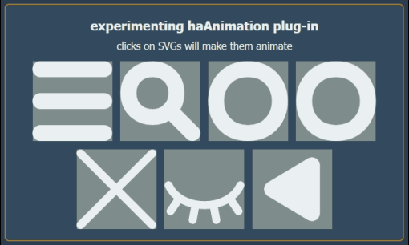

# SVG Transition Plugin
SVGs can sometimes turn into nightmares, especially when it comes to SVG animations. When you have a static animation, they are great, but what if you need an SVG transition? The type of transition that you can dynamically activate or deactivate, similar to how it is done in CSS transitions. The type of transition that can be controlled by adding or removing classes. And finally, the type of transition that you can set its progress programmatically. That is exactly where this plugin comes in. Just look at the following images.

	&#9;

# How It Works?
It is very simple. First, add all the files stored in the repo in your codebase. Then, in your HTML code, add the `haAnimation` class to any `svg` element that begs for a decent transition! Now, for any `path` element inside that `svg` element, the `d` attribute will be considered as the source and the `data-destination` attribute, that you manually add, will become the destination. The next step is the same as how you create CSS transitions, i.e., for any `svg` element of `haAnimation` class,
1. You can enable the plugin by adding haAnimation to the `transition-property` property.
2. You can set the transition duration, delay, or timing function by changing `transition-duration`, `transition-delay`, or `transition-timing-function` properties, as it is done for other CSS transitions.
